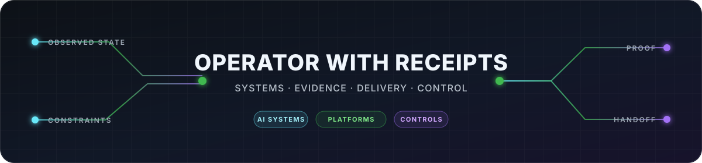
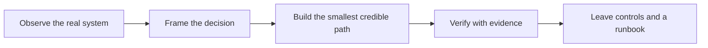

# Tristan Springmeyer

<!-- markdownlint-disable MD033 -->

  

<!-- markdownlint-enable MD033 -->

**Regulated technology operator for AI, cloud, controls, and platform transformation.**

I make complex systems governable through visible evidence, clear operating
models, disciplined delivery, and executive-ready proof.

[Anthrasite](https://www.anthrasite.io) ·
[Next Citizen LLC](https://github.com/next-citizen-llc) ·
[LinkedIn](https://www.linkedin.com/in/tristan-springmeyer) ·
[Public builds](#public-builds)

## What I Build

- **AI-native products** that connect models, workflows, data, commerce, and
  human decisions.
- **Operational repairs** for systems that are important, ambiguous, or stuck.
- **Control surfaces**—architecture decisions, evidence, runbooks, and
  guardrails—that let another team operate what ships.

## Selected Work

### [Anthrasite](https://www.anthrasite.io) — AI-Native Website Intelligence

**Role:** Senior Advisor through Next Citizen LLC

Drove digital-agency engagement, product-market and go-to-market research,
competitive analysis, price-sensitivity sampling, cross-functional OKRs, and
report-design iteration for a product that converts website signals into
prioritized, plain-language business guidance.

`AI-native product` · `GTM systems` · `Voice of customer` · `Report design`

### [FlyATM](https://flyatm.com) — Operational Security & Deliverability

**Scope:** Operational technology engagement

Diagnosed and remediated sender-authentication failures spanning DNS, Google
Workspace, and Salesforce; verified the production state; and left a staged
DMARC-monitoring runbook with explicit safe-stop conditions.

`Security controls` · `SaaS operations` · `Evidence-led repair` · `Runbooks`

### TradeWinds — Regulated Fintech Platform Advisory

**Role:** CTO Advisor through Next Citizen LLC

Advised on secure annuity-data interoperability for RIAs and custodians,
including tokenized-annuity workflow context, blockchain-integrity patterns,
and the DTCC SOD annuity-data ecosystem as an integration target.

`Interoperability` · `Custody context` · `Integrity patterns` · `Advisory`

### [Zoee](https://zoee.com) — Technology Recovery & Rebuild

**Role:** CTO, then Technical Advisor · 2021–2022

Recovered source code and IP, rebuilt a 6-person core team, and authored the
roadmap, architecture, budget, and investor-diligence materials for the
coaching-platform business.

`Recovery leadership` · `Team design` · `Product architecture` · `Diligence`

## Public Builds

| Repository | What It Demonstrates |
| --- | --- |
| [Agent Bridge](https://github.com/next-citizen-llc/agent-bridge) | Installable, local-first CLI, MCP, mailbox, workflow, and continuation infrastructure for bounded collaboration across coding harnesses. |
| [Secure RAG Guard](https://github.com/next-citizen-llc/secure-rag-guard-skill) | Reusable threat-modeling and guardrail patterns for prompt injection, context isolation, and instruction protection in RAG and agent systems. |
| [Refactor Skill](https://github.com/next-citizen-llc/refactor-skill) | A reusable, constraint-aware workflow for turning broad refactoring goals into reviewable code changes. |

## Enterprise Foundations

- **Morgan Stanley:** Program and Technology Manager for the 1 New York Plaza
  Morgan Stanley Fusion Center, an award-winning cyber-threat detection and
  mitigation environment.
- **Bridgewater Associates:** Led or co-led a separate 40-person Digital
  Workspace delivery team supporting Bridgewater's 650-seat Harbor Point
  technology hub.

## My Operating System

1. Start with observed state, not the desired story.
2. Make consequential decisions and authority boundaries explicit.
3. Prefer small, reversible delivery increments.
4. Treat security, privacy, and failure behavior as product requirements.
5. Leave artifacts that survive the handoff: tests, ADRs, evidence, and
   operating instructions.

## Where the Activity Lives

Production, client, and research repositories are organization-owned under
[Next Citizen LLC](https://github.com/next-citizen-llc) or remain private by
design. This profile is the public index. GitHub's contribution graph below is
the live record of commits, issues, and pull requests attributed to this
identity.

## Current Focus

- Local-first infrastructure for reliable collaboration across AI coding tools
- Security and control patterns for RAG and agentic systems
- AI-native product, reporting, and workflow architectures
- Practical modernization for smaller and legacy businesses without
  enterprise-sized overhead

## Connect

Raleigh, North Carolina ·
[LinkedIn](https://www.linkedin.com/in/tristan-springmeyer) ·
[Anthrasite.io](https://www.anthrasite.io) ·
[@next-citizen-llc](https://github.com/next-citizen-llc)

_Client and proprietary systems stay private. Public summaries are scoped to
work that can be discussed without exposing client data, credentials, or
private implementation details._
